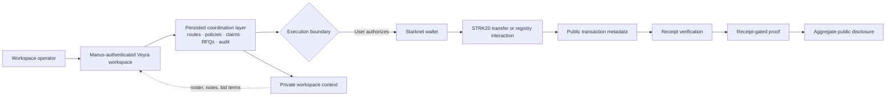

<p align="center">
  
</p>

<p align="center">
  <strong>Private financial coordination for teams operating on Starknet.</strong><br />
  <sub>PREPARE INTENT · AUTHORIZE WITH A WALLET · VERIFY A RECEIPT · REVEAL ONLY THE PROOF</sub>
</p>

<p align="center">
  <a href="https://veilpay-spri-t4knu9mv.manus.space">Live workspace</a> ·
  <a href="https://veilpay-spri-t4knu9mv.manus.space/documentation">Product documentation</a> ·
  <a href="https://files.manuscdn.com/user_upload_by_module/session_file/310519663488625248/UWySWLIQYVhglQGv.mp4">30-second teaser</a> ·
  <a href="https://files.manuscdn.com/user_upload_by_module/session_file/310519663488625248/veJaWSgpcQWfhFVT.mp4">3:10 product walkthrough</a>
</p>

---

## The thesis

> **Move the money. Keep the roster private.**

Most payment tooling makes the operating record public by default: who belongs to a team, who was paid, and how much. Veyra treats that context as private workspace data. Teams prepare a route, gather operational approvals, connect a wallet only at the execution boundary, and expose a compact receipt-backed proof rather than a public roster.

Veyra is built as an institutional operating surface rather than a transfer-button demo. It combines private payroll coordination, treasury guardrails, private claims, sealed-bid market operations, launch governance, and selective disclosure around one explicit lifecycle:

```text
PERSISTED INTENT  →  WALLET AUTHORIZATION  →  SUBMITTED TRANSACTION  →  CONFIRMED RECEIPT  →  SELECTIVE PROOF
```

The distinction is deliberate. A saved route is **not** a transfer. A locally generated link is **not** a wallet signature. A transaction hash is **not** settled until a receipt is verified. Veyra exposes those differences in the interface, API, audit history, and documentation.

---

## Watch Veyra

### Film 01 — The product thesis

<a href="https://files.manuscdn.com/user_upload_by_module/session_file/310519663488625248/UWySWLIQYVhglQGv.mp4">
  
</a>

**[Watch the 30-second Veyra teaser](https://files.manuscdn.com/user_upload_by_module/session_file/310519663488625248/UWySWLIQYVhglQGv.mp4)**. It is a stable H.264/AAC product cut with original score and voiceover, built around the operating boundary from private intent to verified proof.

### Film 00 — The operating model

<a href="https://files.manuscdn.com/user_upload_by_module/session_file/310519663488625248/veJaWSgpcQWfhFVT.mp4">
  
</a>

**[Watch the 3:10 institutional walkthrough](https://files.manuscdn.com/user_upload_by_module/session_file/310519663488625248/veJaWSgpcQWfhFVT.mp4)**. The walkthrough covers the private route workflow, receipt boundary, private primitives, Launchpad, Private Markets, product documentation, and Demo Mode—with deliberate title cards and one-direction product motion.

---

## Product, not a dashboard

| Surface | What it does | Privacy and settlement boundary |
|---|---|---|
| **Private payroll** | Converts a team recipient roster into a structured payment route with lifecycle state, workspace audit history, and proof references. | Recipient identity and individual amounts remain workspace-scoped. A route only becomes a settlement candidate after wallet authorization. |
| **Treasury and operations** | Persists policy templates, thresholds, schedules, approvals, health checks, and audit export data. | Policy or approval state is operational state; it does not move funds or substitute for a signature. |
| **Private claims** | Issues time-bounded, workspace-governed claim workflows without opening a recipient directory. | A claim link or preview is unsigned until a connected wallet and confirmed receipt exist. |
| **Selective proof** | Publishes receipt-gated aggregate proof metadata for a route. | Proof publication is gated by confirmed settlement; raw roster, amounts, and private notes are excluded. |
| **Launchpad governance** | Records project rooms, shielded allocation intent, milestones, and governance decisions. | Milestone records are off-chain workflow data until a real wallet-approved execution is submitted and confirmed. |
| **Private Markets** | Runs persisted RFQs, sealed bids, risk policy checks, lifecycle transitions, alerts, portfolio math, and CSV exports. | Bidder identity and terms remain workspace-scoped; public-facing disclosure is aggregate-only. |
| **Wallet boundary** | Detects Starknet wallets and makes authorization user-operated. | Veyra never creates, stores, exports, or receives a seed phrase, private key, or keystore. |

<p align="center">
  
</p>

---

## Architecture: privacy is an operating model



The browser is a React 19 and Vite application. The backend is an Express 4 and tRPC 11 service with Drizzle ORM persistence against MySQL/TiDB. Authentication is handled through the Manus OAuth flow; every protected mutation derives the workspace member from the authenticated server context rather than trusting a client-supplied user identifier.

| Layer | Implementation | Responsibility |
|---|---|---|
| **Experience** | React 19, Vite, Tailwind 4, Radix primitives | Institutional control surfaces, accessible UI, responsive product documentation, wallet status, and explicit lifecycle states. |
| **Application API** | Express 4, tRPC 11, Zod | Typed procedures for workspaces, routes, recipients, operations, claims, proof references, launch governance, RFQs, bids, and risk checks. |
| **Persistence** | Drizzle ORM, MySQL/TiDB | Workspace-scoped records, audit metadata, policies, lifecycle state, market activity, and public transaction references. |
| **Wallet integration** | Starknet.js 10.4, Starknet wallet discovery | User-owned wallet discovery and authorization. The wallet remains the signing authority. |
| **Contract boundary** | Cairo 2 / `contracts/veyra_payroll` | A non-custodial route and settlement-commitment registry; it does not custody or transfer tokens. |

---

## The truth table

Veyra is designed to avoid the most common credibility failure in financial prototypes: presenting a simulated workflow as a completed on-chain event.

| State shown in Veyra | What is real | What it does **not** mean |
|---|---|---|
| **Persisted** | The authenticated workspace record was stored in the backend. | No chain transaction exists. |
| **Unsigned** | A private claim, governance record, or preview was prepared. | No wallet has approved it. |
| **Wallet pending** | A user has reached the wallet execution boundary. | The wallet may still reject, fail, or be on the wrong network. |
| **Submitted** | A public transaction reference is recorded. | It is not yet confirmed settlement. |
| **Confirmed receipt** | A receipt has been verified and can unlock proof publication. | It does not disclose the private roster or private bid context. |
| **Demo Mode** | Deterministic local interaction state is running. | It never becomes mainnet evidence and never creates a private key. |

### Contract boundary

`contracts/veyra_payroll` is intentionally narrow. It records recipient and settlement commitments and emits lifecycle events, but it does **not** hold or transfer tokens. Token movement remains a wallet-owned STRK20 concern until the official transfer interface and real deployment addresses are supplied. See the [contract README](contracts/veyra_payroll/README.md) for the compile, Sepolia deployment, and production-boundary details.

---

## Explore the product

| Start here | What to inspect |
|---|---|
| [Live workspace](https://veilpay-spri-t4knu9mv.manus.space) | Private route creation, proof ledger, wallet state, operations, and recipient controls. |
| [Documentation](https://veilpay-spri-t4knu9mv.manus.space/documentation) | Architecture narrative, privacy model, 3:10 walkthrough, and eight stable function films. |
| [`Private Markets`](https://veilpay-spri-t4knu9mv.manus.space/private-markets) | RFQ desk, sealed-bid lifecycle, risk policy enforcement, alerts, portfolio analytics, and aggregate disclosure boundary. |
| [`Launchpad`](https://veilpay-spri-t4knu9mv.manus.space/launchpad) | Project rooms, shielded allocation intent, milestones, and governance status. |
| [`Private Primitives`](https://veilpay-spri-t4knu9mv.manus.space/private-primitives) | Claim links, selective disclosure, receipt-gated proofs, and the explicit signed/unsigned distinction. |

---

## Run locally

### Prerequisites

Use **Node.js 22**, **pnpm 10**, and a reachable MySQL/TiDB database. The authenticated deployment also requires the Manus OAuth environment values used by `server/_core/env.ts`; do not commit secrets or copy production credentials into the repository.

```bash
pnpm install
pnpm dev
```

The development server starts the Express/tRPC service and Vite client together. For a production-equivalent verification run:

```bash
pnpm test
pnpm build
pnpm start
```

### Database workflow

Schema lives in `drizzle/schema.ts`; data access helpers live in `server/db.ts`; typed server procedures live in `server/routers.ts`. Generate and apply migrations only against a database you control:

```bash
pnpm db:push
```

### Cairo payroll registry

The registry is a separate Cairo package. Build it from its directory:

```bash
cd contracts/veyra_payroll
scarb build
```

Use a funded testnet account for Sepolia experiments, keep all wallet material outside this repository, and treat the registry as non-custodial coordination infrastructure—not an audited custody or escrow contract.

---

## Repository map

```text
client/                 React application, workspace surfaces, public proof and claim views
server/                 Express/tRPC procedures, persistence helpers, authentication integration
shared/                 Lifecycle semantics, documentation registry, shared operations logic
drizzle/                Database schema and migrations
contracts/veyra_payroll/ Cairo non-custodial payroll registry and tests
strk20.json             Submission metadata; user-owned transaction evidence is intentionally not fabricated
HACKATHON_EVIDENCE.md   Evidence handoff and the remaining owner-operated release steps
SECURITY_AUDIT_STRIX.md Application audit notes
```

---

## Security and privacy commitments

Veyra does not custody seed phrases, private keys, viewing keys, keystores, proof payloads, or plaintext private-transfer notes. The database stores workspace metadata, operator-entered recipient wallet addresses, route totals, lifecycle state, public transaction references, and audit metadata. Recipient notes are operational labels only and must never contain secrets or sensitive payment narratives.

Server procedures enforce workspace membership and role context before mutations. Proof publication requires the relevant receipt-confirmed route state. Private market views are designed to keep bids and identities workspace-scoped while disclosing only permitted aggregate signals.

Report a security concern through the process described in [SECURITY_AUDIT_STRIX.md](SECURITY_AUDIT_STRIX.md). Never include secrets, wallet material, or personal payment data in an issue.

---

## Current evidence boundary

The application, product films, documentation library, backend workflow, test suite, and Cairo registry source are present in this repository. The `transactions` array in `strk20.json` remains empty by design until the project owner performs and records real successful mainnet STRK20 pool interactions. No transaction hash, contract address, reviewer testimony, or mainnet settlement claim is fabricated here.

For the final release procedure, see [HACKATHON_EVIDENCE.md](HACKATHON_EVIDENCE.md). For STRK20 program context, consult the [Starknet STRK20 Private Sprint page](https://strk20.starknet.io/hackathon) and verify its current requirements before any submission.

---

<p align="center">
  <strong>Veyra</strong><br />
  <sub>PRIVATE FINANCIAL COORDINATION · WALLET → RECEIPT → PROOF</sub>
</p>

<p align="center"><a href="LICENSE">MIT License</a></p>
