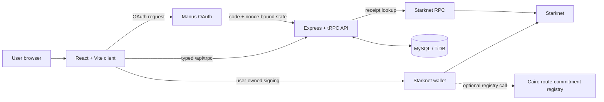
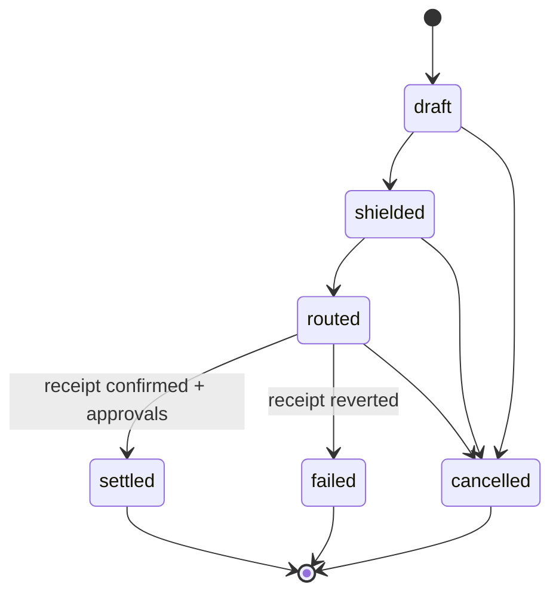
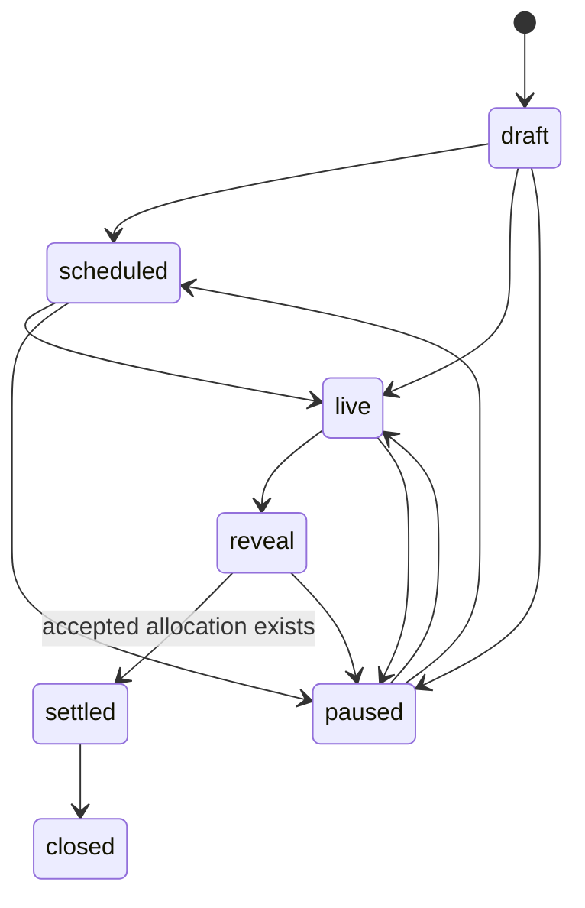

<p align="center">
  
</p>

<p align="center">
  <strong>Private financial coordination for teams operating on Starknet.</strong><br />
  <sub>PREPARE INTENT · AUTHORIZE WITH A WALLET · VERIFY A RECEIPT · REVEAL ONLY THE PROOF</sub>
</p>

<p align="center">
  <a href="https://veilpay-spri-t4knu9mv.manus.space">Live workspace</a> ·
  <a href="https://veilpay-spri-t4knu9mv.manus.space/documentation">Product documentation</a> ·
  <a href="docs/ARCHITECTURE.md">Architecture</a> ·
  <a href="docs/OPERATIONS.md">Operations guide</a> ·
  <a href="https://files.manuscdn.com/user_upload_by_module/session_file/310519663488625248/UWySWLIQYVhglQGv.mp4">30-second teaser</a> ·
  <a href="https://files.manuscdn.com/user_upload_by_module/session_file/310519663488625248/veJaWSgpcQWfhFVT.mp4">3:10 walkthrough</a>
</p>

---

## What Veyra is

> **Move the money. Keep the roster private.**

Veyra is a privacy-first operating system for financial coordination. It gives a team one place to prepare private payroll routes, set treasury policies, coordinate private claims, run sealed-bid market workflows, govern launch milestones, and issue selective proofs—without confusing workspace state for a completed on-chain transaction.

The central product decision is simple: **privacy is not a button; it is a sequence of controlled boundaries.** Veyra persists a private operating intent, defers signing to a user-owned Starknet wallet, verifies the public receipt through an RPC provider, and only then permits a compact proof surface.

```text
PERSISTED INTENT  →  WALLET AUTHORIZATION  →  SUBMITTED TRANSACTION  →  CONFIRMED RECEIPT  →  SELECTIVE PROOF
```

The application presents those states explicitly in the UI, API, persistence layer, audit history, documentation, and tests. It does not call a saved route a transfer, a claim link a signature, or a hash a settlement receipt.

---

## Start here

| Path                                                                                 | What it answers                                                                                              |
| ------------------------------------------------------------------------------------ | ------------------------------------------------------------------------------------------------------------ |
| [**Live workspace**](https://veilpay-spri-t4knu9mv.manus.space)                      | What does the private payroll, treasury, proof, wallet, and operations experience feel like?                 |
| [**Product documentation**](https://veilpay-spri-t4knu9mv.manus.space/documentation) | How does Veyra explain its operating model, privacy posture, Demo Mode, and receipt boundary?                |
| [**Architecture**](docs/ARCHITECTURE.md)                                             | Where do the browser, API, OAuth, database, wallet, RPC provider, and Cairo registry sit in the trust model? |
| [**Operations guide**](docs/OPERATIONS.md)                                           | Which controls are code-enforced, how are they verified, and what still requires the project owner?          |
| [**Cairo registry**](contracts/veyra_payroll/README.md)                              | What does the non-custodial commitment registry do—and intentionally not do?                                 |

---

## Film library

### 01 — The product thesis

<a href="https://files.manuscdn.com/user_upload_by_module/session_file/310519663488625248/UWySWLIQYVhglQGv.mp4">
  
</a>

**[Watch the stable 30-second teaser](https://files.manuscdn.com/user_upload_by_module/session_file/310519663488625248/UWySWLIQYVhglQGv.mp4)**. The cut presents Veyra’s visual system and private-to-proof thesis with original score and voiceover.

### 00 — The operating model

<a href="https://files.manuscdn.com/user_upload_by_module/session_file/310519663488625248/veJaWSgpcQWfhFVT.mp4">
  
</a>

**[Watch the 3:10 product walkthrough](https://files.manuscdn.com/user_upload_by_module/session_file/310519663488625248/veJaWSgpcQWfhFVT.mp4)**. It walks through private routes, wallet and receipt boundaries, private primitives, launch governance, Private Markets, and the in-product guide library.

---

## Product system

| Surface                        | Operational value                                                                                                                                    | Code-backed boundary                                                                                                             |
| ------------------------------ | ---------------------------------------------------------------------------------------------------------------------------------------------------- | -------------------------------------------------------------------------------------------------------------------------------- |
| **Private payroll**            | Turns a recipient roster into a route with approvals, schedules, lifecycle state, audit history, and transaction references.                         | Route data is workspace-scoped. Settlement requires the configured approval threshold; public proof creation requires `settled`. |
| **Treasury and operations**    | Stores token/network policy limits, daily controls, approval thresholds, schedules, balance snapshots, and audit exports.                            | Policy evaluation and membership checks run server-side before workflow changes.                                                 |
| **Claims and selective proof** | Creates recipient claim workflows and receipt-gated public proof slugs.                                                                              | A proof query returns only permitted route summary fields; no recipient roster or individual allocation is returned.             |
| **Launchpad governance**       | Records shielded allocation commitments, projects, milestones, release requests, and readiness checks.                                               | Milestone/release records are coordination data until a wallet-approved and externally verified execution exists.                |
| **Private Markets**            | Provides persisted RFQs, sealed-bid commitments, policy enforcement, operational alerts, lifecycle transitions, portfolio calculations, and exports. | Bids are workspace-scoped; risk checks run before persistence; settlement requires an accepted allocation.                       |
| **Wallet and receipt**         | Discovers Starknet wallets, tracks pending/submitted/confirmed states, and looks up Starknet receipts.                                               | The wallet signs. The server only records and verifies public transaction metadata.                                              |

<p align="center">
  
</p>

---

## Architecture at a glance



The full architecture includes the OAuth sequence, data model, lifecycle state machines, role matrix, trust zones, configuration contract, and code map in **[docs/ARCHITECTURE.md](docs/ARCHITECTURE.md)**.

### Trust model

| Domain             | Veyra can do                                                                                                              | Veyra cannot and does not do                                                               |
| ------------------ | ------------------------------------------------------------------------------------------------------------------------- | ------------------------------------------------------------------------------------------ |
| **Workspace API**  | Persist coordination state, enforce roles, evaluate policy, record public hashes, query receipts, and issue audit events. | Sign a user’s transaction, access a seed phrase, or pretend an unverified hash is settled. |
| **Wallet**         | Present a user-owned approval boundary.                                                                                   | Provide the server with private key material.                                              |
| **Database**       | Store operational metadata and permitted public references.                                                               | Store a private key, recovery phrase, keystore, or plaintext private-transfer note.        |
| **Public proof**   | Reveal an active proof slug and constrained route summary after settlement.                                               | Reveal private roster membership, individual amounts, or sealed bid terms.                 |
| **Cairo registry** | Record non-custodial recipient and settlement commitments.                                                                | Custody or transfer funds; it is not an audited escrow contract.                           |

---

## State machines are part of the product

### Route and proof gate



### Sealed market lifecycle



The route lifecycle is not merely a UI design. `transitionPaymentRoute` enforces approval thresholds for settlement; `recordBlockchainTransaction` binds a hash to a route and network; `confirmBlockchainTransaction` derives status from a Starknet receipt; `createShareableProof` rejects all non-settled routes. Private Market transitions and risk checks are likewise enforced in `server/db.ts` and `shared/operations.ts`.

---

## Evidence and semantics

| State displayed by Veyra | Verified meaning                                               | It does **not** mean                                |
| ------------------------ | -------------------------------------------------------------- | --------------------------------------------------- |
| **Persisted**            | Authenticated workspace state was stored.                      | A transaction exists.                               |
| **Unsigned**             | An action, claim, allocation, or proof candidate was prepared. | A user has approved it in a wallet.                 |
| **Wallet pending**       | The app reached the user-owned signing boundary.               | The transaction will necessarily submit or succeed. |
| **Submitted**            | A route-bound transaction hash was recorded.                   | The chain receipt is confirmed.                     |
| **Confirmed receipt**    | RPC lookup reports succeeded execution and accepted finality.  | Private workspace data becomes public.              |
| **Demo Mode**            | Deterministic local UI state is available for explanation.     | On-chain evidence exists.                           |

This explicit language prevents local state, demo data, and saved transaction identifiers from being presented as settlement evidence.

---

## Security and operating controls

| Control             | Current implementation                                                                                                 |
| ------------------- | ---------------------------------------------------------------------------------------------------------------------- |
| **Authentication**  | Manus OAuth callback with a nonce bound to a one-time browser cookie before code exchange.                             |
| **Authorization**   | Protected tRPC procedures resolve server-side user context and workspace membership; the UI is not the trust boundary. |
| **Roles**           | Owners/admins manage approval and policy; operators run permitted workflows; viewers are read-only.                    |
| **Policy**          | Treasury limits and market bid controls are evaluated before persisting sensitive workflow changes.                    |
| **Receipt status**  | `submitted`, `confirmed`, `reverted`, and `unknown` are distinct states.                                               |
| **Auditability**    | Workspace-scoped mutation events are recorded and exportable.                                                          |
| **Proof safety**    | Shareable proof generation is receipt-gated to settled routes.                                                         |
| **Secret handling** | Veyra never accepts or stores wallet seed phrases, private keys, recovery words, or keystores.                         |

Read the **[Operations and Verification Guide](docs/OPERATIONS.md)** for exact enforcement paths, reviewer flow, local tests, incident posture, and mainnet release gates.

---

## Build and run

### Prerequisites

Use **Node.js 22**, **pnpm 10**, a MySQL/TiDB database you control, and the Manus OAuth environment values required by [`server/_core/env.ts`](server/_core/env.ts). Never commit secrets, production cookies, or wallet material.

```bash
pnpm install
pnpm dev
```

Run the project verification suite and production build:

```bash
pnpm test
pnpm build
pnpm start
```

The current suite contains **14 Vitest files / 64 tests**, covering server routes, workspace isolation, operations and lifecycle logic, documentation, Demo Mode, wallet helpers, and frontend utility behavior.

### Database and contract workflow

```bash
# Generate and apply migrations only against a database you control.
pnpm db:push

# Build the non-custodial Cairo registry.
cd contracts/veyra_payroll
scarb build
```

The registry records commitments. It does **not** custody or transfer tokens. Before any real-fund use, complete the STRK20 transfer semantics, deploy and test on Sepolia, define emergency and role-rotation controls, and obtain an independent security review.

---

## Repository map

```text
client/                    React workspace, public proof/claim views, wallet UI
server/                    Express/tRPC procedures, auth, receipt verification, persistence helpers
shared/                    Lifecycle, policy, disclosure, and documentation registry logic
drizzle/                   MySQL/TiDB schema and migrations
contracts/veyra_payroll/   Cairo non-custodial route and settlement-commitment registry
docs/                      Architecture and operations evidence guides
strk20.json                Submission metadata; no fabricated transaction evidence
HACKATHON_EVIDENCE.md      Owner-operated evidence handoff
SECURITY_AUDIT_STRIX.md    Application audit notes
```

---

## Current evidence boundary

The repository contains the Veyra application, full-stack workflow, technical documentation, product film library, test suite, and Cairo registry source. The `transactions` array in `strk20.json` remains empty by design until the project owner performs real successful STRK20 pool interactions and records their public hashes. No contract address, transaction hash, testimonial, or settlement claim is fabricated in this repository.

For current program context, consult the [Starknet STRK20 Private Sprint page](https://strk20.starknet.io/hackathon) [1]. For the project’s exact architecture and operational evidence, use the repository-local docs linked above.

---

<p align="center">
  <strong>Veyra</strong><br />
  <sub>PRIVATE FINANCIAL COORDINATION · WALLET → RECEIPT → PROOF</sub><br /><br />
  <a href="LICENSE">MIT License</a>
</p>

## References

[1]: https://strk20.starknet.io/hackathon "STRK20 Private Sprint"
