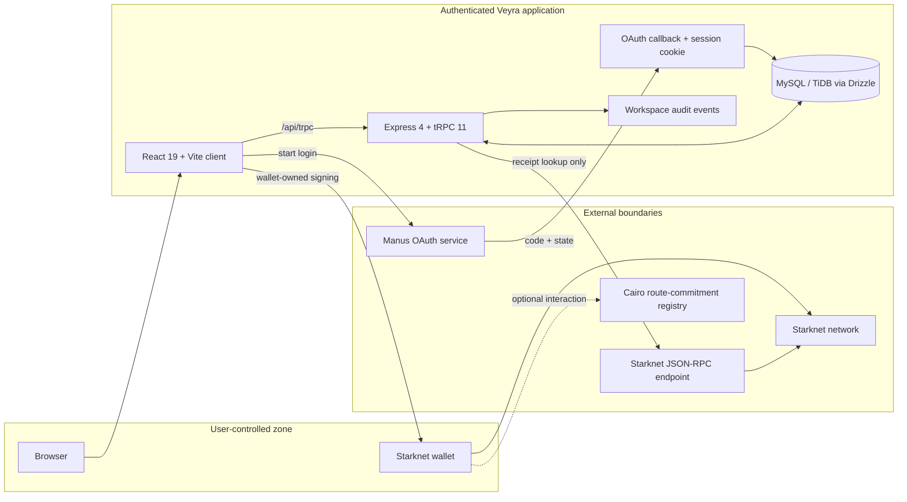
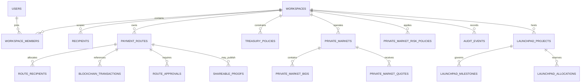
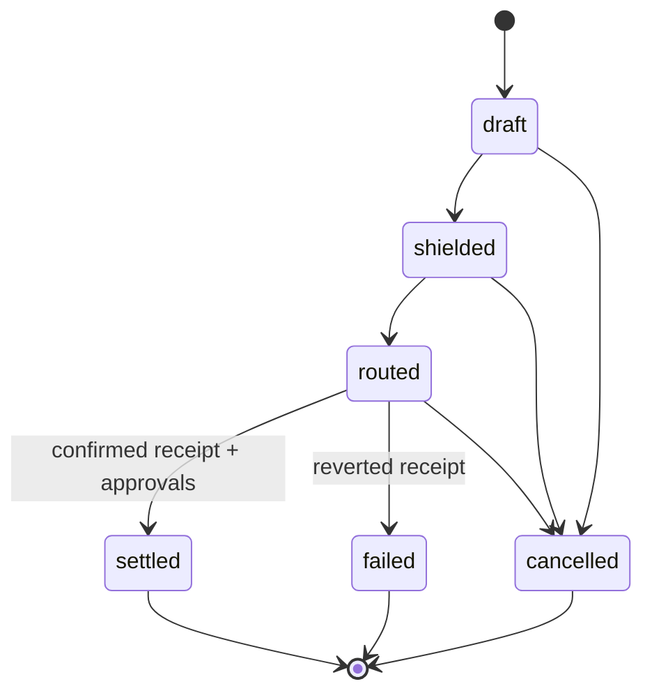
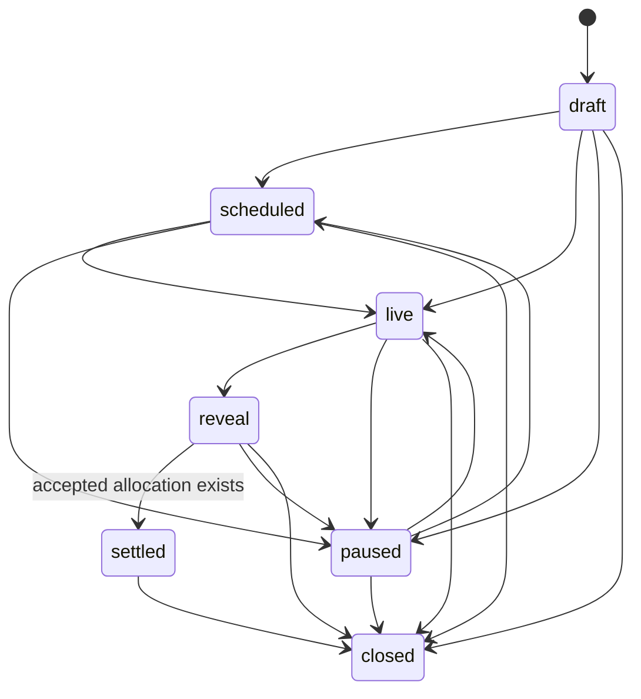
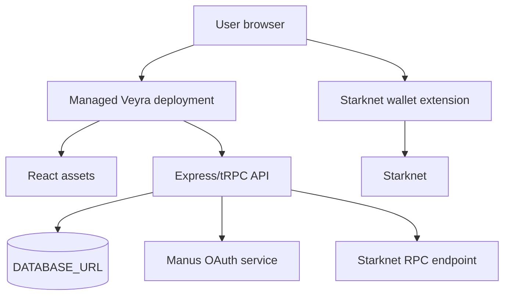

# Veyra Architecture

> **Scope.** This is an implementation map of the current repository. It distinguishes code-backed behavior from wallet-owned and future deployment responsibilities; it does not describe an audited custody protocol.

## 1. System context



The application is a single full-stack project: the client and API are developed together, while the **wallet**, **RPC**, and **Cairo registry** remain separate trust domains. The server stores coordination state and confirms public receipt status; it never receives wallet secret material.

## 2. Trust domains and data classification

| Zone                  | Stored or handled data                                                                                                         | Trust boundary                                                                   | Explicit exclusion                                                                   |
| --------------------- | ------------------------------------------------------------------------------------------------------------------------------ | -------------------------------------------------------------------------------- | ------------------------------------------------------------------------------------ |
| Browser / wallet      | Account selection, network selection, signature approval                                                                       | The user controls approval and can reject any call.                              | Veyra does not receive a seed phrase, private key, or keystore.                      |
| Veyra application API | Authenticated workspace context, lifecycle mutations, audit events, public transaction references                              | tRPC protected procedures resolve the server-side user and workspace membership. | It does not sign transactions or fabricate confirmed receipts.                       |
| Database              | Workspace metadata, recipient addresses entered by operators, route totals, policies, claims, bids, commitments, audit records | Each query/mutation is workspace-scoped.                                         | It does not store seed phrases, raw wallet secrets, or plain private-transfer notes. |
| Receipt verification  | Public transaction hash, route network, execution/finality status                                                              | The API queries a Starknet RPC endpoint for receipt status.                      | A submitted hash is not a confirmation result.                                       |
| Public proof view     | Active proof slug, route name, token, total amount, route status, proof reference                                              | Proof creation is server-gated to a settled route.                               | It does not expose route recipients, individual allocations, or private bid terms.   |

## 3. Authentication and workspace resolution

```mermaid
sequenceDiagram
  participant U as User browser
  participant C as Veyra client
  participant M as Manus OAuth
  participant O as /api/oauth/callback
  participant D as User + workspace tables

  U->>C: Select Sign in
  C->>C: Generate nonce; write one-time host cookie
  C->>M: OAuth request with encoded state
  M-->>O: code + state
  O->>O: Decode state and compare nonce cookie
  alt nonce mismatch
    O-->>U: 403 invalid oauth state
  else nonce valid
    O->>M: Exchange code; read user info
    O->>D: Upsert user and resolve membership
    O->>U: Secure session cookie; redirect to /
  end
```

The callback implementation is in [`server/_core/oauth.ts`](../server/_core/oauth.ts). It rejects a missing or mismatched nonce before exchanging an authorization code. The application then creates a session token and uses protected tRPC procedures for workspace data access.

## 4. Route, wallet, receipt, and proof sequence

```mermaid
sequenceDiagram
  participant Op as Owner / admin / operator
  participant API as Veyra API
  participant DB as Database
  participant W as Wallet
  participant R as Starknet RPC
  participant P as Public proof view

  Op->>API: Create or edit draft route
  API->>DB: Validate workspace, recipients, policy; persist intent
  Op->>API: Record submitted transaction reference
  API->>DB: Bind unique hash to route + network
  Op->>W: Review and approve wallet transaction
  W-->>R: Submit to Starknet
  Op->>API: Confirm transaction hash
  API->>R: getTransactionReceipt(hash)
  R-->>API: execution + finality status
  API->>DB: Mark confirmed/reverted/unknown and transition route
  alt confirmed + approvals satisfied
    Op->>API: Create proof
    API->>DB: Create active proof slug for settled route
    P->>API: Read public proof slug
  else not settled
    API-->>Op: Proof publication rejected
  end
```

The API verifies `SUCCEEDED` execution with `ACCEPTED_ON_L2` or `ACCEPTED_ON_L1` finality before classifying a receipt as `confirmed`. The implementation is in [`server/db.ts`](../server/db.ts), specifically `verifyStarknetReceipt`, `confirmBlockchainTransaction`, and `createShareableProof`.

## 5. Persisted model



The authoritative table definitions are in [`drizzle/schema.ts`](../drizzle/schema.ts). Every operational entity carries either a `workspaceId` or a project that is obtained through workspace membership before access is granted.

## 6. Lifecycle gates

### Payment route



The database prevents `settled` when the workspace approval threshold is not met. Proof creation checks `route.status === "settled"` and otherwise rejects the request.

### Sealed private market



The server enforces this transition map and rejects settlement when no accepted bid exists. Bid commitment accepts only live markets within the bid deadline and evaluates per-bid, concentration, and target-capacity policy before persistence.

## 7. Role matrix

| Capability                              | Owner | Admin | Operator | Viewer |
| --------------------------------------- | :---: | :---: | :------: | :----: |
| Read workspace-scoped data              |  Yes  |  Yes  |   Yes    |  Yes   |
| Manage recipients                       |  Yes  |  Yes  |   Yes    |   No   |
| Create and transition routes            |  Yes  |  Yes  |   Yes    |   No   |
| Decide route approvals                  |  Yes  |  Yes  |    No    |   No   |
| Manage treasury / market risk policy    |  Yes  |  Yes  |    No    |   No   |
| Create RFQs, markets, schedules, proofs |  Yes  |  Yes  |   Yes    |   No   |
| Acknowledge operating alerts            |  Yes  |  Yes  |   Yes    |   No   |

The router applies these checks server-side before invoking data helpers. The UI is not treated as an authorization boundary.

## 8. Deployment topology and configuration



| Variable                                                 | Required by      | Purpose                                                       |
| -------------------------------------------------------- | ---------------- | ------------------------------------------------------------- |
| `DATABASE_URL`                                           | API              | MySQL/TiDB connection string.                                 |
| `JWT_SECRET`                                             | API              | Session-token signing configuration.                          |
| `VITE_APP_ID`                                            | Client and API   | Manus application identity.                                   |
| `OAUTH_SERVER_URL`                                       | API              | Manus OAuth endpoint.                                         |
| `OWNER_OPEN_ID`                                          | API              | Project-owner context.                                        |
| `BUILT_IN_FORGE_API_URL` / `BUILT_IN_FORGE_API_KEY`      | API              | Built-in platform service access.                             |
| `STARKNET_MAINNET_RPC_URL` or `STARKNET_SEPOLIA_RPC_URL` | Receipt verifier | Optional RPC override; a public fallback is used when absent. |

The current managed deployment is available at [veilpay-spri-t4knu9mv.manus.space](https://veilpay-spri-t4knu9mv.manus.space). A Vercel frontend deployment is intentionally deferred until the Vercel owner completes GitHub OAuth authorization and the OAuth callback origin is configured for that domain.

## 9. Code map

| Concern                             | Primary implementation path                             |
| ----------------------------------- | ------------------------------------------------------- |
| Route / proof / receipt rules       | [`server/db.ts`](../server/db.ts)                       |
| API authorization and role checks   | [`server/routers.ts`](../server/routers.ts)             |
| Shared lifecycle and risk utilities | [`shared/operations.ts`](../shared/operations.ts)       |
| Database schema                     | [`drizzle/schema.ts`](../drizzle/schema.ts)             |
| OAuth callback and nonce binding    | [`server/_core/oauth.ts`](../server/_core/oauth.ts)     |
| Wallet adapters and network config  | [`client/src/lib/`](../client/src/lib/)                 |
| Cairo registry                      | [`contracts/veyra_payroll`](../contracts/veyra_payroll) |
| Product walkthrough registry        | [`shared/documentation.ts`](../shared/documentation.ts) |
